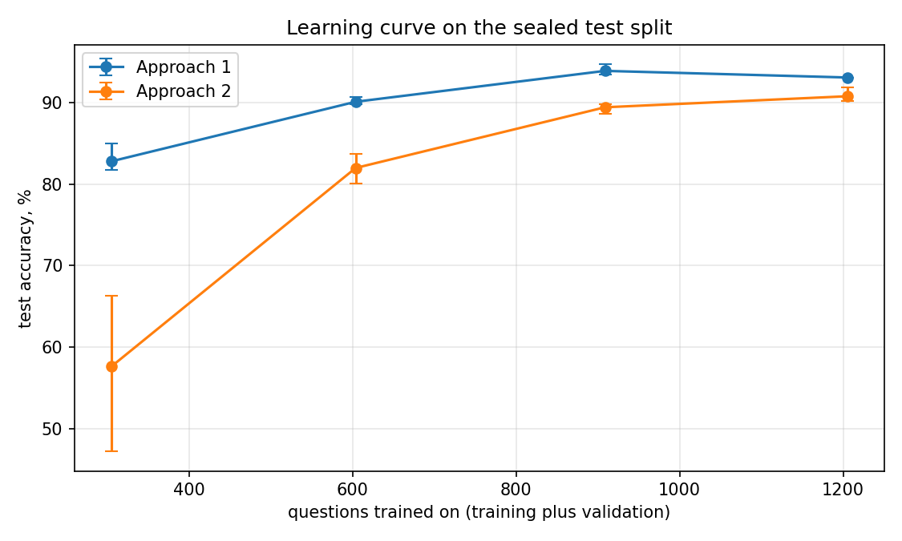

# Learning curve

Generated by `python3 tools/report_learning_curve.py` from the run ledger. Generated 2026-09-07. Nothing here is typed by hand.

## What was varied, and what was not

Each point trains one approach on a fraction of the training pool and scores it on the sealed test split. The procedure is the one RESULTS.md measures both approaches under: train on the training split, tune on validation, refit from scratch on training plus validation, score the sealed test split. Only the amount of training data changes.

A subsample takes whole papers, never single questions, by the same grouping `src/split.py` uses: dropping half of a paper's questions and keeping the rest would leave the model that paper's house style and context at a quarter of the row count, which is not what a quarter of the data looks like. Training and validation are subsampled independently at the same fraction, so the split's own proportions hold at every point.

The test split never moves. It is `test.jsonl`, 246 questions, sha256 `18a133a52404aac9`, out of the frozen `data/private/questions.jsonl`, 1451 labelled rows, sha256 `4a867fef7dbd8718`. Every run in the ledger carries that test hash and the fraction it was trained on; a run against any other split is ignored, and a fractional run cannot reach RESULTS.md.

## Approach 1

Runs at seeds 42, 43 and 44, each point a from-scratch run on that fraction of the training pool.

| Training pool | Rows trained on | Mean test accuracy | Lowest to highest | 95% interval | Macro-F1 | Train time |
|---|---|---|---|---|---|---|
| 25% | 305 | **82.8%** | 81.7% to 85.0% | 77.6% to 87.0% | 0.82 | 0.4 s |
| 50% | 604 | **90.1%** | 89.8% to 90.7% | 85.7% to 93.2% | 0.89 | 1.0 s |
| 75% | 909 | **93.9%** | 93.5% to 94.7% | 90.2% to 96.3% | 0.94 | 1.4 s |
| 100% | 1,205 | **93.1%** | 93.1% to 93.1% | 89.2% to 95.6% | 0.94 | 1.6 s |

Timed on: Apple M3 Pro, 18 GB, CPU. Train time is wall-clock on a laptop that was in use between runs, so it reflects contention as much as data size and is not a measurement of how training scales.

| Step | Rows added | Accuracy gained |
|---|---|---|
| 25% to 50% | 299 | +7.3 points |
| 50% to 75% | 305 | +3.8 points |
| 75% to 100% | 296 | -0.8 points |

The last step of the curve, tested question by question. Each row pairs one seed's 75% run against the same seed's 100% run on the same test questions, so nothing differs between the two but the amount of training data.

| Seed | Both right | Only the smaller pool right | Only the full pool right | Both wrong | Difference | 95% interval on the difference | Exact p |
|---|---|---|---|---|---|---|---|
| 42 | 226 | 4 | 3 | 13 | -0.4 points | -2.5 points to +1.7 points | 1.00 |
| 43 | 223 | 7 | 6 | 10 | -0.4 points | -3.3 points to +2.5 points | 1.00 |
| 44 | 227 | 6 | 2 | 11 | -1.6 points | -3.9 points to +0.6 points | 0.29 |

**The curve has flattened: more data is not the binding constraint.** Accuracy rises +10.3 points across 25% to 100%, and the last step, 75% to 100%, is -0.8 points. The paired test on that last step does not reach p < 0.05 for any of the 3 seeds (p between 0.29 and 1.00), so the last quarter of the training pool bought nothing measurable, and a further quarter would be expected to buy no more.

## Approach 2

Runs at seeds 42, 43 and 44, each point a from-scratch run on that fraction of the training pool.

| Training pool | Rows trained on | Mean test accuracy | Lowest to highest | 95% interval | Macro-F1 | Train time |
|---|---|---|---|---|---|---|
| 25% | 305 | **57.6%** | 47.2% to 66.3% | 51.3% to 63.6% | 0.53 | 14 min 43 s |
| 50% | 604 | **82.0%** | 80.1% to 83.7% | 76.7% to 86.3% | 0.82 | 17 min 53 s |
| 75% | 909 | **89.4%** | 88.6% to 89.8% | 85.0% to 92.7% | 0.90 | 9 min 58 s |
| 100% | 1,205 | **90.8%** | 90.2% to 91.9% | 86.5% to 93.8% | 0.91 | 15 min 22 s |

Timed on: Apple M3 Pro, 18 GB, MPS. Train time is wall-clock on a laptop that was in use between runs, so it reflects contention as much as data size and is not a measurement of how training scales.

| Step | Rows added | Accuracy gained |
|---|---|---|
| 25% to 50% | 299 | +24.4 points |
| 50% to 75% | 305 | +7.5 points |
| 75% to 100% | 296 | +1.4 points |

The last step of the curve, tested question by question. Each row pairs one seed's 75% run against the same seed's 100% run on the same test questions, so nothing differs between the two but the amount of training data.

| Seed | Both right | Only the smaller pool right | Only the full pool right | Both wrong | Difference | 95% interval on the difference | Exact p |
|---|---|---|---|---|---|---|---|
| 42 | 218 | 3 | 8 | 17 | +2.0 points | -0.6 points to +4.7 points | 0.23 |
| 43 | 215 | 6 | 7 | 18 | +0.4 points | -2.5 points to +3.3 points | 1.00 |
| 44 | 212 | 6 | 10 | 18 | +1.6 points | -1.6 points to +4.8 points | 0.45 |

**The curve has flattened: more data is not the binding constraint.** Accuracy rises +33.2 points across 25% to 100%, and the last step, 75% to 100%, is +1.4 points. The paired test on that last step does not reach p < 0.05 for any of the 3 seeds (p between 0.23 and 1.00), so the last quarter of the training pool bought nothing measurable, and a further quarter would be expected to buy no more.

## Do the two curves have the same shape?

The two curves are not the same shape. Over the range measured Approach 1 gains +10.3 points and Approach 2 +33.2 points, so Approach 2 is the one that benefits more from data, by 22.9 points. That comparison is between two means of three seeds each on 246 test questions, so it is a difference in slope worth naming rather than a precise measurement of one.
