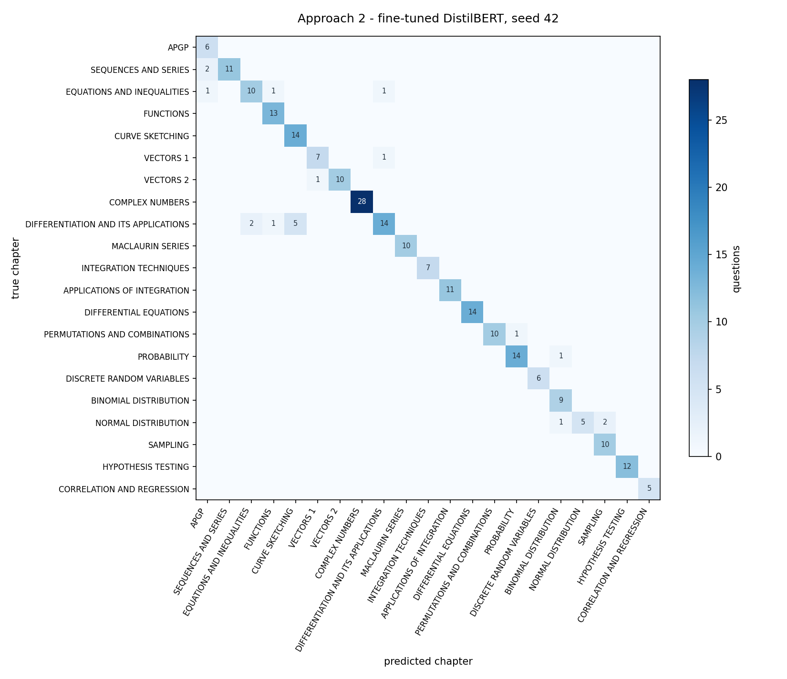

# sorted(mathematics)

Give it an H2 Mathematics exam question, get back the chapter it belongs to.

```
$ python3 src/predict.py "The mass of a randomly chosen metal disc follows a
                          normal distribution with mean 22 grams and standard
                          deviation 0.8 grams. 2 metal discs are randomly
                          chosen. Find the probability that the mass of one of
                          the discs is less than 23 grams and the other metal
                          disc has mass more than 23 grams."

   62.3%  NORMAL DISTRIBUTION                    ###################
    5.1%  BINOMIAL DISTRIBUTION                  ##
    4.6%  SAMPLING                               #
```

That is a real prelim question with the values changed, from a paper the model
was never trained on. The percentages sit low because the chosen TF-IDF and
regularisation setup keeps the weights small across all 21 chapters.

**A word counter matches a fine-tuned transformer here, at a fraction of the
cost.** TF-IDF and logistic regression scores 93.1% on the 246 questions held
back from training; a fine-tuned DistilBERT scores 90.8% on the same
questions, and a paired test cannot tell the two apart. The word counter trains
in 1.6 seconds against 15 minutes for the transformer, with 10,884 features
against 67 million parameters, and it can show you the words behind every
decision.

## Running it

```
pip install -r requirements.txt
python3 src/predict.py "your question here"
```

By default the classifier always answers. Pass `--min-confidence` to let it
decline when its leading chapter falls below a cutoff. It still prints the top
candidates and their confidences when it declines:

```
python3 src/predict.py --min-confidence 0.50 "your question here"
```

The trained classifier is committed, so that runs from a clone. The corpus
behind it does not ship. It is past-year exam material, so the questions
themselves stay off this repository, which means the extractors, `src/merge.py`,
`src/split.py` and `src/train.py` have nothing to read from a clone. The tests
need none of it, because they run on synthetic fixtures:

```
python3 -m pytest
```

Every number on this page is regenerated by `tools/report_results.py` and
written to [RESULTS.md](RESULTS.md).

The amount of training data is measured separately in
[LEARNING-CURVE.md](LEARNING-CURVE.md), generated from fractional ledger runs
by `tools/report_learning_curve.py`.

---

## Why it exists

Building a revision package is two jobs. The interesting one is deciding which
questions a student actually needs. The tedious one comes first: sorting a stack
of past-year papers into chapters, question by question, before you can start
choosing anything. I have done it by hand every year, but the job is one that
requires judgement, which is worth handing to a model.

The 21 chapters are the ones I build my own revision packages around, so a
prediction says which package a question goes in.

There is no public dataset for this, so I built the corpus first. 1,451
questions from past-year papers, labelled at source, deduplicated. The question
text itself stays out of the repository.

## Not leaking the test set

Questions from one exam paper are not independent samples. They share a setter,
a house style, and often the same context across parts. Split rows at random and
questions from one paper end up in both training and test. The accuracy goes up
and nothing reports it.

`src/split.py` assigns whole groups instead. A group is one paper, or one
tutorial for questions with no context.

| | Groups divided across splits |
|---|---|
| Naive row-level shuffle | **130 of 154** |
| Group-aware split | **0** |

## Two approaches

### Approach 1 — TF-IDF and logistic regression

Count which words appear in a question, weight the rare ones higher, learn one
set of word weights per chapter.

**93.1% on the test set, 95% interval 89.2% to 95.6%, macro-F1 0.94. Trains in
1.6 seconds.**

Regularisation is tuned on the validation split, then the model is refit on
training plus validation. `class_weight="balanced"` stops the model from ignoring
the small chapters. Complex Numbers has 152 questions, Correlation and Regression
has 32.

### Approach 2 — fine-tuned DistilBERT

DistilBERT is 66 million parameters that have already read billions of words of
English. It reads a sentence in order rather than as a bag of words, so "the
line meets the plane" and "the plane meets the line" are two different sentences
to it, while they are identical to Approach 1.

**90.8% on the test set averaged over three seeds, 95% interval 86.5% to 93.8%,
macro-F1 0.91. Trains in 15 minutes.**

The loss was unweighted while Approach 1 used balanced class weights. Weighting
it was worth 0.8 points, 91.5% to 92.3% at seed 42. The tokeniser truncated at
256 tokens while TF-IDF read every word: 84 of the 1,451 questions run past 256,
and the longest loses more than half of itself. The limit is now 512, worth
another 1.6 points. Both deltas come from `tools/compare_runs.py`, and both are
differences between single runs, so they are inside the same noise as the gap
between the two approaches: they were fixed because they made the comparison
fair, not because the numbers proved them.

The epoch count is chosen on validation, then the model is retrained from
scratch on training plus validation. Validation accuracy is still climbing at
five epochs on every run, so `MAX_EPOCHS` is a ceiling rather than a choice.

### Which one I would actually run

Approach 1, judged on what matters here.

| | Approach 1 | Approach 2 |
|---|---|---|
| Test accuracy, mean of 3 seeds | 93.1% | 90.8% |
| 95% interval on that accuracy | 89.2% to 95.6% | 86.5% to 93.8% |
| Standard deviation across seeds | 0.0 points | 0.9 points |
| Macro-F1 | 0.94 | 0.91 |
| Training time, Apple M3 Pro | **1.6 seconds** | 15 min 22 s |
| Parameters | **10,884 features × 21** | 66,969,621 |
| Explains itself | **yes** | no |

On accuracy the two are statistically indistinguishable. A test set of 246
questions puts about three points of noise on any accuracy measured against
it, the two intervals overlap, and the paired test on the questions exactly
one model got right gives p between 0.17 and 0.65 across the three transformer
seeds. The 2.3-point gap is real on this test set and would not be surprising
on the next one in either direction. Both models were measured the same way: trained
from scratch at seeds 42, 43 and 44 on the frozen split, tuned on validation,
refit on training plus validation, scored on the sealed test rows, timed on the
same machine. [RESULTS.md](RESULTS.md) has the paired counts, the intervals and
the rule that chose the verdict.

What separates them is cost. Approach 1 trained nearly 600 times faster with
nearly 300 times fewer parameters, and it reached the same place.

The training data did not justify the 66 million parameters. The signal for which
chapter a question belongs to is mostly vocabulary: "argand", "significance
level" and "position vector" signal Complex Numbers, Hypothesis Testing and
Vectors. Finding the words that decide a label is precisely what TF-IDF is built
to do. A transformer's advantage is understanding word order and context, and
there is very little in this problem that needs it.

Both rows regenerate from the run ledger in `data/private/runs/`, which
`tools/compare_runs.py seeds --record` fills and `tools/report_results.py`
reads. Every record carries the hash of the test split it was scored on, so a
model that outlives its split cannot put a training-set score into the table.
The transformer itself is 268 MB and is not committed; Approach 1's model is,
and its predictions match its ledger runs exactly.

## What each model gets wrong

The two models are not separated by accuracy. They are separated by what they
fail on.


Approach 1 confuses my own boundaries:

| | |
|---|---|
| Differentiation called Curve Sketching | 3 times |
| Sequences and Series called APGP | 2 times |
| Twelve other pairs, noise | once each |

The mistakes come from me splitting the line between two very similar chapters.

Approach 2 makes the same mistake, more often. Its seed 42 run:

| | |
|---|---|
| Differentiation called Curve Sketching | 5 times |
| Differentiation called Equations | 2 times |
| Normal Distribution called Sampling | 2 times |
| Sequences and Series called APGP | 2 times |
| Nine other pairs, noise | once each |



The same boundary trips both models.

## Checking what it learned

Five sources read by three extractors give the model a way to cheat. If one
chapter comes mostly from one source, the model can learn what that source's text
looks like instead of what the question is about. `src/evaluate.py` prints the
strongest words per chapter, so this can be checked.

```
COMPLEX NUMBERS       argand, arg, roots, argand diagram, complex number, form
HYPOTHESIS TESTING    significance, level, sample, null, test at, the mean
VECTORS 2             plane, the line, perpendicular, vector equation, planes
CORRELATION           product moment, scatter, regression line, coefficient
```

No school names, no years, no extraction artefacts. If any had appeared, the
accuracy would not mean anything.

## Layout

```
src/extract_latex.py       revision packages and LaTeX tutorials
src/extract_pdf.py         PDF tutorials and the 971-page topical bank
src/extract_triplemath.py  the exercise book, skipping Further Maths and H3
src/merge.py               deduplication and grouping
src/split.py               leakage-safe train/val/test split
src/features.py            TF-IDF, fitted on training rows only
src/train.py               Approach 1
src/evaluate.py            Approach 1 measurement
src/train_transformer.py   Approach 2
src/evaluate_transformer.py  Approach 2 measurement, same report shape
src/runs.py                one from-scratch run of either approach, and the ledger
src/intervals.py           confidence intervals and the paired test, pure Python
src/learning_curve.py      group-aware training-pool subsampling
src/predict.py             the command-line demo, with an optional refusal cutoff
src/abstention.py          the refusal option: cutoffs over the pipeline's own confidence
src/chapters.py            the 21 chapters
src/paths.py               where things live, and the one write guard
tests/test_split.py        33 tests, mostly about leakage
tests/test_merge.py        2 tests, about deduplication
tests/test_intervals.py    22 tests, about the statistics
tools/                     one-off measurements, not part of the pipeline
tools/compare_runs.py      the seed runs both approaches are measured by
tools/learning_curve.py    records fractional training-pool runs
tools/report_results.py    writes RESULTS.md, the confusion matrices and the abstention curve
tools/report_learning_curve.py  writes LEARNING-CURVE.md and its plot
tools/report_abstention.py  sweeps the abstention cutoff and draws its curve
```
