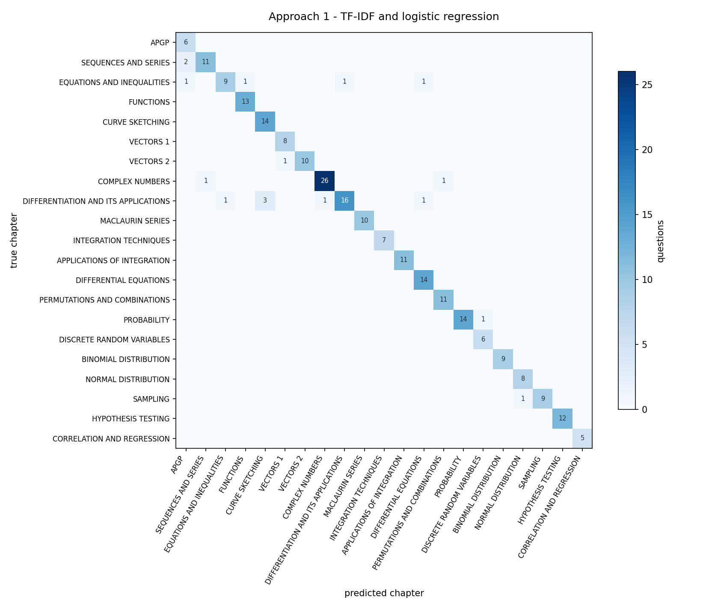

# Results

Generated by `python3 tools/report_results.py` against the frozen dataset below. Generated 2026-08-26. Nothing here is typed by hand.

## The frozen dataset

`data/private/questions.jsonl`, 1451 labelled rows, sha256 `4a867fef7dbd8718`.

| Split | Rows |
|---|---|
| train | 988 |
| val | 217 |
| test | 246 |

Per-chapter row counts across the whole corpus:

| Chapter | Rows |
|---|---|
| APGP | 45 |
| SEQUENCES AND SERIES | 78 |
| EQUATIONS AND INEQUALITIES | 73 |
| FUNCTIONS | 67 |
| CURVE SKETCHING | 92 |
| VECTORS 1 | 54 |
| VECTORS 2 | 72 |
| COMPLEX NUMBERS | 152 |
| DIFFERENTIATION AND ITS APPLICATIONS | 130 |
| MACLAURIN SERIES | 68 |
| INTEGRATION TECHNIQUES | 48 |
| APPLICATIONS OF INTEGRATION | 76 |
| DIFFERENTIAL EQUATIONS | 86 |
| PERMUTATIONS AND COMBINATIONS | 67 |
| PROBABILITY | 76 |
| DISCRETE RANDOM VARIABLES | 41 |
| BINOMIAL DISTRIBUTION | 61 |
| NORMAL DISTRIBUTION | 42 |
| SAMPLING | 45 |
| HYPOTHESIS TESTING | 46 |
| CORRELATION AND REGRESSION | 32 |

## Headline

| | Approach 1 | Approach 2 |
|---|---|---|
| Test accuracy | **93.1%** | not measurable |
| Macro-F1 | **0.94** | not measurable |
| Test questions | 246 | 246 |

Single runs at the default seed.

## Confusion matrices

The saved transformer is older than the split it would be scored against, so its accuracy would be a training-set score wearing a test set's name, and this report withholds it rather than print it under a caveat nobody reads. Retraining it puts the number back. The README's Approach 2 figure is a three-seed mean recorded when the model and the split still matched.

## What Approach 1 confuses

| True chapter | Called it | Times |
|---|---|---|
| DIFFERENTIATION AND ITS APPLICATIONS | CURVE SKETCHING | 3 |
| SEQUENCES AND SERIES | APGP | 2 |
| PROBABILITY | DISCRETE RANDOM VARIABLES | 1 |
| EQUATIONS AND INEQUALITIES | FUNCTIONS | 1 |
| DIFFERENTIATION AND ITS APPLICATIONS | COMPLEX NUMBERS | 1 |
| EQUATIONS AND INEQUALITIES | DIFFERENTIATION AND ITS APPLICATIONS | 1 |
| EQUATIONS AND INEQUALITIES | DIFFERENTIAL EQUATIONS | 1 |
| EQUATIONS AND INEQUALITIES | APGP | 1 |

14 distinct pairs in all, 12 of them confused exactly once.

## Approach 1 per chapter

| Chapter | Precision | Recall | F1 | Test questions |
|---|---|---|---|---|
| APGP | 0.67 | 1.00 | 0.80 | 6 |
| SEQUENCES AND SERIES | 0.92 | 0.85 | 0.88 | 13 |
| EQUATIONS AND INEQUALITIES | 0.90 | 0.69 | 0.78 | 13 |
| FUNCTIONS | 0.93 | 1.00 | 0.96 | 13 |
| CURVE SKETCHING | 0.82 | 1.00 | 0.90 | 14 |
| VECTORS 1 | 0.89 | 1.00 | 0.94 | 8 |
| VECTORS 2 | 1.00 | 0.91 | 0.95 | 11 |
| COMPLEX NUMBERS | 0.96 | 0.93 | 0.95 | 28 |
| DIFFERENTIATION AND ITS APPLICATIONS | 0.94 | 0.73 | 0.82 | 22 |
| MACLAURIN SERIES | 1.00 | 1.00 | 1.00 | 10 |
| INTEGRATION TECHNIQUES | 1.00 | 1.00 | 1.00 | 7 |
| APPLICATIONS OF INTEGRATION | 1.00 | 1.00 | 1.00 | 11 |
| DIFFERENTIAL EQUATIONS | 0.88 | 1.00 | 0.93 | 14 |
| PERMUTATIONS AND COMBINATIONS | 0.92 | 1.00 | 0.96 | 11 |
| PROBABILITY | 1.00 | 0.93 | 0.97 | 15 |
| DISCRETE RANDOM VARIABLES | 0.86 | 1.00 | 0.92 | 6 |
| BINOMIAL DISTRIBUTION | 1.00 | 1.00 | 1.00 | 9 |
| NORMAL DISTRIBUTION | 0.89 | 1.00 | 0.94 | 8 |
| SAMPLING | 1.00 | 0.90 | 0.95 | 10 |
| HYPOTHESIS TESTING | 1.00 | 1.00 | 1.00 | 12 |
| CORRELATION AND REGRESSION | 1.00 | 1.00 | 1.00 | 5 |

## Example predictions

Questions written for this repository, so nothing here quotes a real paper. Output is `src/predict.py`'s, top three chapters each.

> The time a student takes to finish a practice paper is normally distributed with mean 95 minutes and standard deviation 12 minutes. Two students are chosen at random. Find the probability that exactly one of them finishes in under 90 minutes.

     42.2%  NORMAL DISTRIBUTION
     10.1%  PROBABILITY
      5.6%  BINOMIAL DISTRIBUTION

> The complex number w satisfies |w - 3i| = |w + 4|. Sketch the locus of w on an Argand diagram, and find the least possible value of |w|.

     56.6%  COMPLEX NUMBERS
      2.9%  SEQUENCES AND SERIES
      2.8%  CURVE SKETCHING

> The plane p has equation r . (2i - j + 2k) = 6. The line l passes through the point with position vector i + 3j and is parallel to i + k. Find the acute angle between l and p.

     72.9%  VECTORS 2
      5.5%  VECTORS 1
      2.4%  DIFFERENTIATION AND ITS APPLICATIONS

> A machine is set to fill packets with 500 g of flour. A random sample of 40 packets has mean mass 497.2 g and standard deviation 6.1 g. Test, at the 5% significance level, whether the machine is underfilling.

     50.7%  HYPOTHESIS TESTING
      9.0%  SAMPLING
      5.7%  NORMAL DISTRIBUTION

> Using the substitution u = 1 + tan x, find the exact value of the integral of (sec^2 x) / (1 + tan x)^3 with respect to x, from x = 0 to x = pi/4.

     30.4%  INTEGRATION TECHNIQUES
     11.7%  DIFFERENTIATION AND ITS APPLICATIONS
      7.8%  APPLICATIONS OF INTEGRATION

> Water leaks from a tank so that the depth h cm satisfies dh/dt = -k root h, where k is a positive constant. Given that the depth falls from 64 cm to 36 cm in 10 minutes, find the time taken for the tank to empty.

     14.3%  DIFFERENTIAL EQUATIONS
      9.3%  DIFFERENTIATION AND ITS APPLICATIONS
      6.4%  SEQUENCES AND SERIES

> A committee of 5 is chosen from 6 men and 7 women. Find the number of ways the committee can be formed if it must contain at least 2 men, and the oldest woman refuses to serve alongside the youngest man.

     37.3%  PERMUTATIONS AND COMBINATIONS
      5.3%  BINOMIAL DISTRIBUTION
      5.0%  PROBABILITY

> The curve C has equation y = (x^2 - 4) / (x - 1). Find the coordinates of the stationary points of C, and hence sketch C, stating the equations of its asymptotes.

     47.2%  CURVE SKETCHING
      9.0%  DIFFERENTIATION AND ITS APPLICATIONS
      4.1%  VECTORS 2

> The first three terms of a geometric progression are x, x + 6 and 4x - 6. Find the possible values of x, and the sum to infinity of the progression that converges.

     27.0%  APGP
     16.3%  SEQUENCES AND SERIES
      4.1%  COMPLEX NUMBERS

